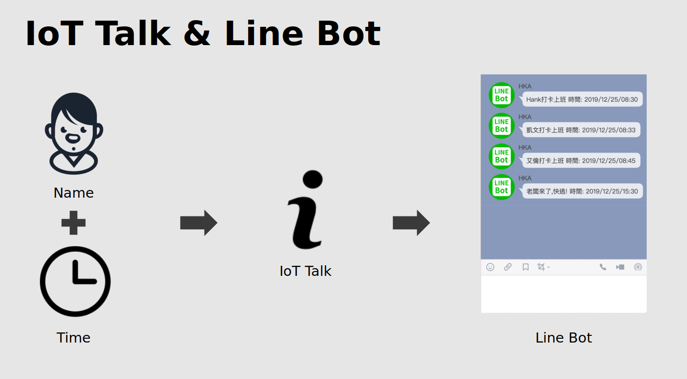
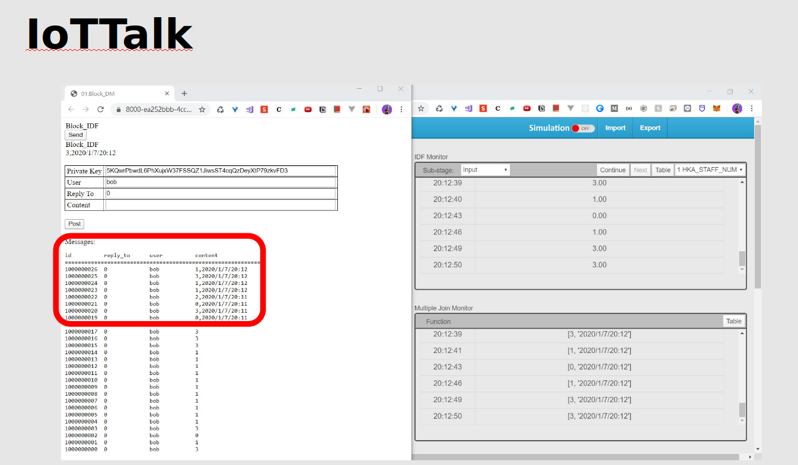

# IoT Exam - Boss Detection AIoT
###### tags: `IoT`

### 

### (1) Tools & Reference
- Reference
    -    https://chtseng.wordpress.com/2018/06/01/boss-sensor-%E8%80%81%E9%97%86%E5%81%B5%E6%B8%AC%E5%99%A8/

- environment
    - anaconda python=3.6
    - packages : numpy scipy / scikit-learn / imutils / opencv_contrib_python
    - `$ git clone https://github.com/ch-tseng/Boss-Sensor`
 

### (2) Save Training Data
- Create file
    - original (save original photo)
    - process （empty file , wait for next step to use）
    
    

 

### (3) Process Training Data
- Detection Training Data parameter
    - sourePath : the path save the original data.
    - savePath : the path save the processed data.
    - face_size_min : the min size of face in the photo.
    - cascade : lbpcascade_frontalface.xml / haarcascade_frontalface_default.xml
-  extract-faces.py
    -  modify the source path / save path
    -  **compile** extract-faces.py
    
- datasets create (1)safe / (2)boss file
    - 
    - classify process file's photo to safe/boss file
        

 

### (4) Face Detection Training model
- train.py
    - facePath = "datasets"
    - face_min = number of boss photo in boss file (ex:28)
    - face_size = (47, 62)
    - test_size = 0.25
    - **compile** train.py
    <a/>
      
                    

 

### (5) IoTTalk
 
 
 
