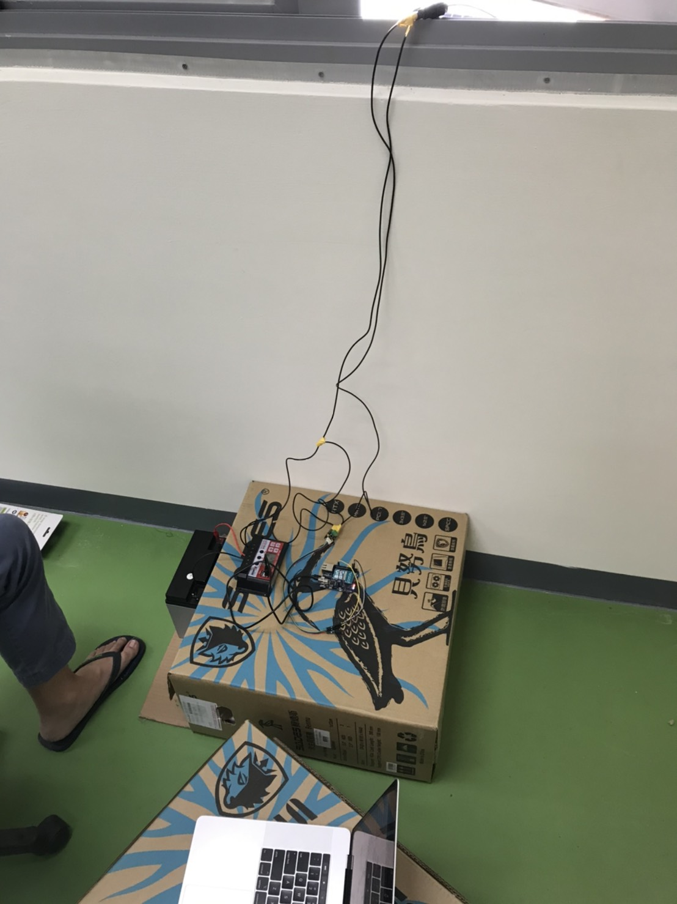
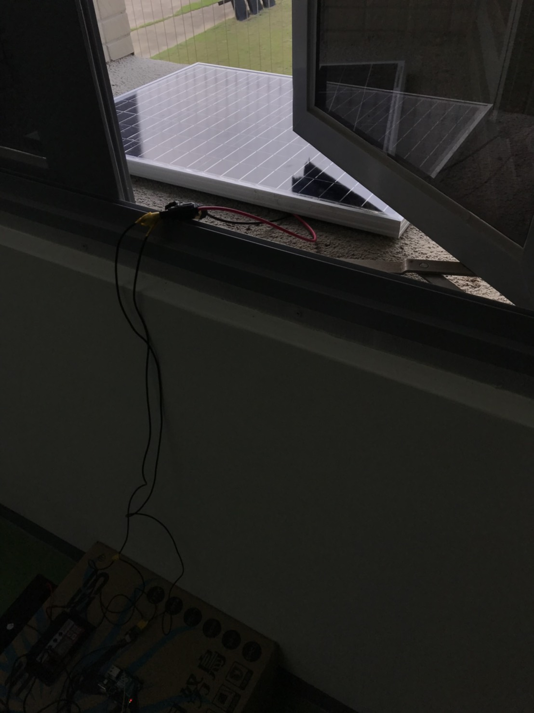

# Green Energy

### Step1 - Install Device
* device architecture reference :  
  
*  Demo :  
  
  

### Step2 - Set Arduino & Create Dashboard
* Set arduino reference : 
  1. https://drive.google.com/file/d/1VBm8EknyPANynNuwsmrHMpeHXHOdBu-k/view?usp=sharing
  2. https://drive.google.com/file/d/13D_pV3V8zTPbFObTAUXWKhlSloTQ-2cH/view?usp=sharing
* Set dashboard reference : 
  1. [iottalk-Dashboard](https://github.com/aaron851113/iottalk/blob/master/web/%E7%89%A9%E8%81%AF%E7%B6%B2(11_27)%20Dashboard.md)
  2. [GitLab](https://drive.google.com/open?id=13AyBQ-3m_RuPOW1J2aR1yD0svUKuEFdg)
*  Demo :  
  
